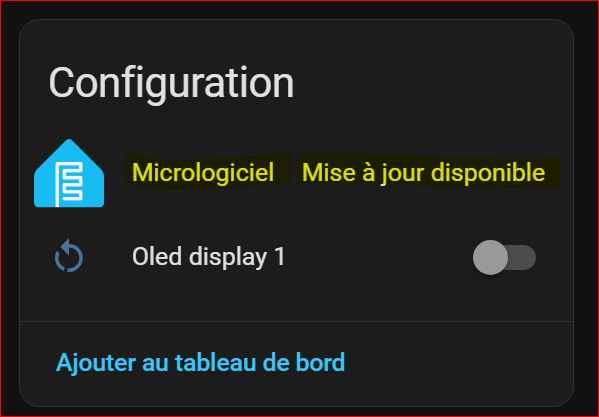

# 🚀 ESPHome Smart Updater

> ⚡ Automate and control your ESPHome OTA updates like a pro

<p align="center">
  
  
  
  
  
  
</p>


---

## ✨ Overview

**ESPHome Smart Updater** lets you update all your ESPHome devices in a **controlled, automated, and safe way**.

No more manual updates one by one.
👉 Launch a campaign and let the integration handle everything:

* queue
* throttling
* monitoring
* reporting

---

## 🎥 Preview


---

## 📸 Dashboard


---

## ✨ Features

### 🔄 OTA Campaign Engine

* Queue-based **serial updates**
* Automatic detection of **pending ESPHome updates**
* Full lifecycle tracking:

  * Remaining
  * Done
  * Failed
  * Skipped

### 🧠 Smart Throttling

* Dynamic delay based on:

  * CPU usage
  * CPU temperature
  * System load (1m)
* Prevents overload while maximizing update speed

### 📊 Real-Time Dashboard

* Clean Home Assistant card
* Live tracking:

  * Current device
  * Progress
  * ETA
  * Dynamic delay
* Inline error monitoring

### 📑 Reporting, Notifications & Events

* 📟 Full campaign report (stored + UI)
* 🔔 Persistent notification at campaign end
* 📡 Home Assistant event fired at the end of each campaign:
  `esphome_smart_updater_campaign_finished`

  This event includes:

  * result (success / error / stopped)
  * done / failed / skipped counts
  * duration
  * final report text
  * failed devices details

👉 Perfect for automations, logging, or external integrations

### ⏯ Full Control

* ▶ Start
* ⏸ Pause
* 🔁 Resume
* ⏹ Stop
* 🧹 Clear report

Accessible via:

* UI
* Home Assistant services
* automations

### 🔁 Resilience

* Automatic resume after Home Assistant restart
* Optional delayed resume after startup
* No progress lost

### 🌍 Multi-language

* 🇬🇧 English
* 🇫🇷 Français
* 🇪🇸 Español
* 🇩🇪 Deutsch
* 🇮🇹 Italiano
* 🇵🇹 Português (BR)
* 🇵🇹 Português (PT)
* 🇳🇱 Nederlands
* 🇵🇱 Polski
* 🇨🇿 Čeština
* 🇪🇸 Català

> The interface automatically adapts to your Home Assistant language.

## ⚠️ Prerequisite: Enable ESPHome Firmware Update Entities

For the integration to work properly, you must ensure that **firmware update entities are enabled** for each ESPHome device.

### Why?
The Smart Updater relies on `update.*` entities provided by ESPHome to detect and install firmware updates.  
If these entities are disabled, the integration will not detect any available updates.

### How to enable them

1. Go to **Settings → Devices & Services → ESPHome**
2. Select one of your ESPHome devices
3. Open the **Entities** tab
4. Look for the entity named something like:
   - `update.<device_name>_firmware`
5. Make sure it is **enabled**

Repeat this for each ESPHome device you want to include in the campaign.

### Example



## 🛠 Installation

### 🔘 Option 1 — One-click install

[](https://my.home-assistant.io/redirect/hacs_repository/?owner=PaulBiod&repository=ha-esphome-smart-updater&category=integration)

---

### 🧱 Option 2 — Manual HACS install

1. Open **HACS**
2. Go to **Integrations**
3. Click **⋮ → Custom repositories**
4. Add:

   ```
   https://github.com/PaulBiod/ha-esphome-smart-updater
   ```
5. Category: **Integration**
6. Install **ESPHome Smart Updater**
7. Restart Home Assistant
8. Go to **Settings → Devices & Services**
9. Click **Add Integration**
10. Search for **ESPHome Smart Updater**

---

## ⚙️ Configuration

After adding the integration:

- Configure throttling (optional)
- Select sensors:
  - CPU usage
  - CPU temperature
  - Load 1m

👉 These sensors are available via the [System Monitor integration](https://www.home-assistant.io/integrations/systemmonitor/) 

---

## 🧾 Services

```yaml
esphome_smart_updater.start_campaign
esphome_smart_updater.pause_campaign
esphome_smart_updater.resume_campaign
esphome_smart_updater.stop_campaign
esphome_smart_updater.clear_report
```

---

## 📡 Event (for Automations)

Event fired at the end of a campaign:

```
esphome_smart_updater_campaign_finished
```

### Example automation

```yaml
automation:
  - alias: ESPHome Campaign Finished
    trigger:
      - platform: event
        event_type: esphome_smart_updater_campaign_finished
    action:
      - service: notify.mobile_app_phone
        data:
          message: "ESPHome update finished!"
```

---


## 📊 Lovelace Card

The dashboard card is **not added automatically**.

Once the integration is installed, you can add it manually:

1. Go to your Home Assistant dashboard  
2. Click **Edit dashboard**  
3. Click **+ Add card**  
4. Select **Manual**  
5. Copy the YAML from [`examples/card.yaml`](examples/card.yaml)

<details>
<summary><strong>Show card YAML</strong></summary>

```yaml
type: vertical-stack
cards:
  - type: custom:mushroom-title-card
    title: >
       {{ t.title if t.title is defined else 'ESPHome Smart Updater' }}
    subtitle: >
           
        ⏸ {{ t.paused if t.paused is defined else 'Paused' }} • {{ i }}/{{ t_total }}
      
        ▶ {{ t.running if t.running is defined else 'Running' }} • {{ i }}/{{ t_total }}
      
        
          {{ state_attr('sensor.esphome_smart_updater_campaign','no_update_text') }}
        
          {{ (t.updates_available if t.updates_available is defined else '{count} update(s) available') | replace('{count}', n|string) }}
        
      
  - type: conditional
    conditions:
      - condition: or
        conditions:
          - condition: state
            entity: sensor.esphome_smart_updater_campaign
            state: running
          - condition: state
            entity: sensor.esphome_smart_updater_campaign
            state: paused
    card:
      type: tile
      entity: sensor.esphome_smart_updater_progress
      name: Progress
      hide_state: false
      vertical: false
      features_position: bottom
      features:
        - type: bar-gauge
          min: 0
          max: 100
  - type: conditional
    conditions:
      - condition: state
        entity: sensor.esphome_smart_updater_campaign
        state: idle
      - condition: state
        entity: binary_sensor.esphome_smart_updater_report_available
        state: "on"
    card:
      type: vertical-stack
      cards:
        - type: markdown
          content: >
             ### 📟 {{ t.report if t.report is defined else 'Last
            report' }}

            {{ state_attr('sensor.esphome_smart_updater_campaign','last_report')
            or '' }}
        - type: custom:mushroom-template-card
          primary: >
             {{ t.clear_report if t.clear_report is defined else 'Clear
            report' }}
          icon: mdi:broom
          icon_color: red
          tap_action:
            action: call-service
            service: esphome_smart_updater.clear_report
  - type: conditional
    conditions:
      - condition: state
        entity: sensor.esphome_smart_updater_campaign
        state: idle
      - condition: state
        entity: sensor.esphome_smart_updater_pending_updates
        state_not: "0"
      - condition: state
        entity: sensor.esphome_smart_updater_pending_updates
        state_not: unknown
      - condition: state
        entity: sensor.esphome_smart_updater_pending_updates
        state_not: unavailable
    card:
      type: custom:mushroom-template-card
      primary: >
         {{ t.start if t.start is defined else 'Start' }}
      secondary: >
         {{ (t.updates_available if t.updates_available is defined else
        '{count} update(s) available') | replace('{count}',
        (states('sensor.esphome_smart_updater_pending_updates') |
        int(0))|string) }}
      icon: mdi:play
      icon_color: green
      tap_action:
        action: call-service
        service: esphome_smart_updater.start_campaign
  - type: conditional
    conditions:
      - condition: or
        conditions:
          - condition: state
            entity: sensor.esphome_smart_updater_campaign
            state: running
          - condition: state
            entity: sensor.esphome_smart_updater_campaign
            state: paused
    card:
      type: vertical-stack
      cards:
        - type: custom:mushroom-template-card
          primary: >
             {{ t.current_device if t.current_device is defined else
            'Current device' }}
          secondary: >
              
              
              
              
              
              {{ name }}
              
              {{ inst }} → {{ latest }}
              
              
              {{ t.running_label if t.running_label is defined else 'Running' }}
              
            
              -
            
          multiline_secondary: true
          icon: mdi:chip
        - type: grid
          columns: 3
          square: false
          cards:
            - type: custom:mushroom-template-card
              primary: >
                
                {{ t.success if t.success is defined else 'Success' }}
              secondary: >
                {{ (state_attr('sensor.esphome_smart_updater_campaign','done')
                or []) | count }}
              icon: mdi:check
            - type: custom:mushroom-template-card
              primary: >
                
                {{ t.failed if t.failed is defined else 'Failed' }}
              secondary: >
                {{ (state_attr('sensor.esphome_smart_updater_campaign','failed')
                or []) | count }}
              icon: mdi:alert
            - type: custom:mushroom-template-card
              primary: >
                
                {{ t.skipped if t.skipped is defined else 'Skipped' }}
              secondary: >
                {{
                (state_attr('sensor.esphome_smart_updater_campaign','skipped')
                or []) | count }}
              icon: mdi:skip-next
        - type: grid
          columns: 2
          square: false
          cards:
            - type: custom:mushroom-template-card
              primary: >
                
                {{ t.eta if t.eta is defined else 'ETA' }}
              secondary: >
                  {% set m = (s % 3600) // 60 %}
                
                  {{ '%dh%02dmn' | format(h, m) }}
                
                  {{ '%d mn' | format(m) }}
                
              icon: mdi:timer
            - type: custom:mushroom-template-card
              primary: >
                
                {{ t.delay if t.delay is defined else 'Dynamic delay' }}
              secondary: >
                {{ state_attr('sensor.esphome_smart_updater_campaign','delay_s')
                | int(0) }} s
              icon: mdi:timer-sand
        - type: conditional
          conditions:
            - condition: state
              entity: binary_sensor.esphome_smart_updater_current_error_visible
              state: "on"
          card:
            type: custom:mushroom-template-card
            primary: >
                
                {{ t.error_critical if t.error_critical is defined else 'Critical error' }}
              
                {{ t.error_current if t.error_current is defined else 'Current error' }}
              
            secondary: >
                
               {{ lines |
              join('\n') }}
            multiline_secondary: true
            icon: >
              
                mdi:alert-circle
              
                mdi:alert-outline
              
            icon_color: >
              
                red
              
                orange
              
        - type: conditional
          conditions:
            - condition: state
              entity: binary_sensor.esphome_smart_updater_throttle_enabled
              state: "on"
          card:
            type: vertical-stack
            cards:
              - type: custom:mushroom-title-card
                title: >
                   {{ t.server_load if t.server_load is defined else 'Server
                  load' }}
              - type: grid
                columns: 3
                square: false
                cards:
                  - type: custom:mushroom-template-card
                    primary: >
                        🔴 {{ t.cpu if t.cpu is defined else
                      'CPU' }}⚠️ {{ t.cpu if t.cpu is defined
                      else 'CPU' }}{{ t.cpu if t.cpu is defined else
                      'CPU' }}
                    secondary: "{{ states('sensor.processor_use') }} %"
                    icon: mdi:cpu-64-bit
                  - type: custom:mushroom-template-card
                    primary: >
                        🔴 {{ t.cpu_temp if t.cpu_temp
                      is defined else 'CPU Temp' }}⚠️ {{
                      t.cpu_temp if t.cpu_temp is defined else 'CPU Temp' }}{{ t.cpu_temp if t.cpu_temp is defined else 'CPU
                      Temp' }}
                    secondary: "{{ states('sensor.processor_temperature') }} °C"
                    icon: mdi:thermometer
                  - type: custom:mushroom-template-card
                    primary: >
                        🔴 {{ t.load_1m if t.load_1m is defined else
                      'Load 1m' }}⚠️ {{ t.load_1m if
                      t.load_1m is defined else 'Load 1m' }}{{
                      t.load_1m if t.load_1m is defined else 'Load 1m' }}
                    secondary: "{{ states('sensor.load_1m') }}"
                    icon: mdi:gauge
        - type: conditional
          conditions:
            - condition: state
              entity: binary_sensor.esphome_smart_updater_pause_info_visible
              state: "on"
          card:
            type: markdown
            content: >
                   
                🔄 {{ t.waiting_ha if t.waiting_ha is defined else 'Waiting for Home Assistant startup' }}
              
                🔄 {{ (t.resume_in if t.resume_in is defined else 'Resuming in {time}') | replace('{time}', '%02d:%02d' | format(left // 60, left % 60)) }}
              
        - type: conditional
          conditions:
            - condition: state
              entity: sensor.esphome_smart_updater_campaign
              state: running
            - condition: state
              entity: binary_sensor.esphome_smart_updater_stop_requested
              state: "on"
          card:
            type: custom:mushroom-template-card
            primary: >
               {{ t.stop_requested if t.stop_requested is defined else
              'Stop requested' }}
            secondary: >
               {{ t.stop_wait if t.stop_wait is defined else 'The
              current device finishes flashing before stopping' }}
            icon: mdi:stop-circle-outline
            icon_color: red
            tap_action:
              action: none
        - type: conditional
          conditions:
            - condition: state
              entity: sensor.esphome_smart_updater_campaign
              state: running
            - condition: state
              entity: binary_sensor.esphome_smart_updater_stop_requested
              state: "off"
            - condition: state
              entity: binary_sensor.esphome_smart_updater_pause_requested
              state: "on"
          card:
            type: custom:mushroom-template-card
            primary: >
               {{ t.pause_requested if t.pause_requested is defined else
              'Pause requested' }}
            secondary: >
               {{ t.pause_wait if t.pause_wait is defined else 'The
              current device finishes flashing before pausing' }}
            icon: mdi:pause-circle-outline
            icon_color: orange
            tap_action:
              action: none
        - type: conditional
          conditions:
            - condition: state
              entity: sensor.esphome_smart_updater_campaign
              state: running
            - condition: state
              entity: binary_sensor.esphome_smart_updater_stop_requested
              state: "off"
            - condition: state
              entity: binary_sensor.esphome_smart_updater_pause_requested
              state: "off"
            - condition: state
              entity: binary_sensor.esphome_smart_updater_last_device_running
              state: "off"
          card:
            type: horizontal-stack
            cards:
              - type: custom:mushroom-template-card
                primary: >
                   {{ t.pause if t.pause is defined else 'Pause' }}
                icon: mdi:pause
                icon_color: orange
                tap_action:
                  action: call-service
                  service: esphome_smart_updater.pause_campaign
              - type: custom:mushroom-template-card
                primary: >
                   {{ t.stop if t.stop is defined else 'Stop' }}
                icon: mdi:stop
                icon_color: red
                tap_action:
                  action: call-service
                  service: esphome_smart_updater.stop_campaign
        - type: conditional
          conditions:
            - condition: state
              entity: binary_sensor.esphome_smart_updater_last_device_running
              state: "on"
            - condition: state
              entity: binary_sensor.esphome_smart_updater_stop_requested
              state: "off"
            - condition: state
              entity: binary_sensor.esphome_smart_updater_pause_requested
              state: "off"
          card:
            type: custom:mushroom-template-card
            primary: >
               {{ t.last_device if t.last_device is defined else 'Last
              device running' }}
            secondary: >
               {{ t.last_device_info if t.last_device_info is defined
              else 'No pause or stop is useful on the last flash' }}
            icon: mdi:information-outline
            icon_color: blue
            tap_action:
              action: none
        - type: conditional
          conditions:
            - condition: state
              entity: sensor.esphome_smart_updater_campaign
              state: paused
          card:
            type: horizontal-stack
            cards:
              - type: custom:mushroom-template-card
                primary: >
                   {{ t.resume if t.resume is defined else 'Resume' }}
                icon: mdi:play
                icon_color: green
                tap_action:
                  action: call-service
                  service: esphome_smart_updater.resume_campaign
              - type: custom:mushroom-template-card
                primary: >
                   {{ t.stop if t.stop is defined else 'Stop' }}
                icon: mdi:stop
                icon_color: red
                tap_action:
                  action: call-service
                  service: esphome_smart_updater.stop_campaign
        - type: markdown
          content: >
             ### 📟 {{ t.infos if t.infos is defined else 'Infos' }}{% set m = (s % 3600)
            // 60 %}{% set sec = s % 60 %}&emsp; • &emsp;{{ t.duration if
            t.duration is defined else 'Duration' }} : {{ '%dh
            %02dmn' | format(h, m) }}{{ '%dmn %02ds' | format(m, sec)
            }}

             

            **{{ t.current if t.current is defined else 'Current' }} :** {{
            state_attr(e,'friendly_name') if e else '-' }}

            **{{ t.next_1 if t.next_1 is defined else 'Next 1' }} :** {{
            state_attr(r[1],'friendly_name') if r|count > 1 else '-' }}

            **{{ t.next_2 if t.next_2 is defined else 'Next 2' }} :** {{
            state_attr(r[2],'friendly_name') if r|count > 2 else '-' }}

            **{{ t.next_3 if t.next_3 is defined else 'Next 3' }} :** {{
            state_attr(r[3],'friendly_name') if r|count > 3 else '-' }}

            **{{ t.error if t.error is defined else 'Error' }} :** {{
            state_attr('sensor.esphome_smart_updater_campaign','last_error') or
            '-' }}


```

</details>

---

### 💡 Notes

* Requires **Mushroom cards** (custom:mushroom-*)
* Fully dynamic and multi-language
* No additional helpers required

---

## 🔎 Preview (Dry-Run)

The preview mode lets you simulate the next ESPHome update campaign before launching anything.

It is designed as a **pre-flight snapshot**:
- see which devices **would be updated**
- see which devices are **in scope but already up to date**
- see which devices are **out of scope**
- see which devices are **not included because of the configured max batch size**

> [!IMPORTANT]
> Preview is **not live**.
> It is automatically invalidated when the real world changes:
> - integration options change
> - available ESPHome updates change
> - a campaign starts and devices begin to update  
>
> This is intentional: preview is meant to help you decide **before** running a campaign.

### What the preview shows

- **Planned updates** → devices that would be updated now
- **In scope without update** → selected/included devices that are already up to date
- **Out of scope** → devices excluded by the current selection mode
- **Not included** → devices excluded only because the configured `max_items` limit was reached

### Example Lovelace card
<details>
<summary><strong>Show card preview YAML</strong></summary>

```yaml
type: vertical-stack
cards:
  - type: custom:mushroom-title-card
    title: >
       {{ t.title }} • {{ t.preview }}
    subtitle: >
       
       
        {{ t.preview_none }}
      
        ⚠️ {{ t.preview_control_mode }}
      
        {{ t.preview_devices_count.replace('{count}', count|string) }}
      
  - type: custom:mushroom-template-card
    primary: >
       {{ t.preview_generate }}
    secondary: >
        
        {{ t.preview_last_generation.replace('{date}', as_datetime(ts).strftime('%d/%m/%Y %H:%M:%S')) }}
      
        {{ t.preview_none_available }}
      
    icon: mdi:refresh
    icon_color: blue
    tap_action:
      action: call-service
      service: esphome_smart_updater.preview_campaign
  - type: markdown
    content: >
       _{{ t.preview_hint }}_
  - type: conditional
    conditions:
      - condition: state
        entity: binary_sensor.esphome_smart_updater_preview_available
        state: "on"
    card:
      type: vertical-stack
      cards:
        - type: markdown
          content: >
               

            **{{ t.mode_label }} :** {{ mode or '-' }}

            <font color="#AAAAAA">{{ mode_help or '' }}</font>

            <br> <sub>* {{ t.preview_not_included_with_limit.replace('{max}',
            max_items|string) }}</sub>
        - type: grid
          columns: 2
          square: false
          cards:
            - type: custom:mushroom-template-card
              primary: >
                
                {{ t.preview_updates_planned }}
              secondary: >
                {{
                state_attr('sensor.esphome_smart_updater_campaign','preview_targets_count')
                | int(0) }}
              icon: mdi:update
              icon_color: green
            - type: custom:mushroom-template-card
              primary: >
                
                {{ t.preview_in_scope_no_update }}
              secondary: >
                {{
                state_attr('sensor.esphome_smart_updater_campaign','preview_in_scope_no_update_count')
                | int(0) }}
              icon: mdi:progress-clock
              icon_color: yellow
            - type: custom:mushroom-template-card
              primary: >
                
                {{ t.preview_out_of_scope }}
              secondary: >
                {{
                state_attr('sensor.esphome_smart_updater_campaign','preview_out_of_scope_count')
                | int(0) }}
              icon: mdi:filter-variant
              icon_color: blue
            - type: custom:mushroom-template-card
              primary: >
                
                {{ t.preview_not_included }} *
              secondary: >
                {{
                state_attr('sensor.esphome_smart_updater_campaign','preview_overflow_count')
                | int(0) }}
              icon: mdi:playlist-remove
              icon_color: red
        - type: markdown
          content: >-
            

            


            ### 🟢 {{ t.preview_targets_title }}


            

            {{ t.none }}

            

            

            • {{ item.name if item.name is defined else item.entity_id if
            item.entity_id is defined else item }}

            

            <br><font color="#AAAAAA">{{ item.installed_version }} → {{
            item.latest_version }}</font>

            


            

            
        - type: markdown
          content: >-
            

            


            ### 🟡 {{ t.preview_in_scope_no_update_title }}


            

            {{ t.none }}

            

            

            • {{ item.name if item.name is defined else item.entity_id if
            item.entity_id is defined else item }}


            

            
        - type: markdown
          content: >-
            

            


            ### 🔵 {{ t.preview_out_of_scope_expand }}


            

            {{ t.none }}

            

            <details><summary><b>{{ t.preview_out_of_scope_expand
            }}</b></summary>


            

            • {{ item.name if item.name is defined else item.entity_id if
            item.entity_id is defined else item }}


            

            </details>

            

```

</details>

---

### Full example

See the complete preview card example here:

- [`examples/card.yaml`](./examples/card_preview.yaml)


### Notes

- The preview only reflects the state **at the moment it was generated**
- If something changes, generate it again
- This makes the preview reliable as a decision tool, instead of showing stale information

## 💡 Example Use Case

👉 You have 20+ ESPHome devices
👉 Multiple updates available

Instead of updating manually:

* launch campaign
* monitor progress
* receive full report

---

## ⚠️ Notes

* Requires Home Assistant restart after install/update
* After restart, you must add the integration from
  **Settings → Devices & Services**
* Designed for local ESPHome OTA management

---

## ❤️ Support

* ⭐ Star the repo
* 🐛 Report issues
* 💡 Suggest improvements

---

## 📜 License

MIT
