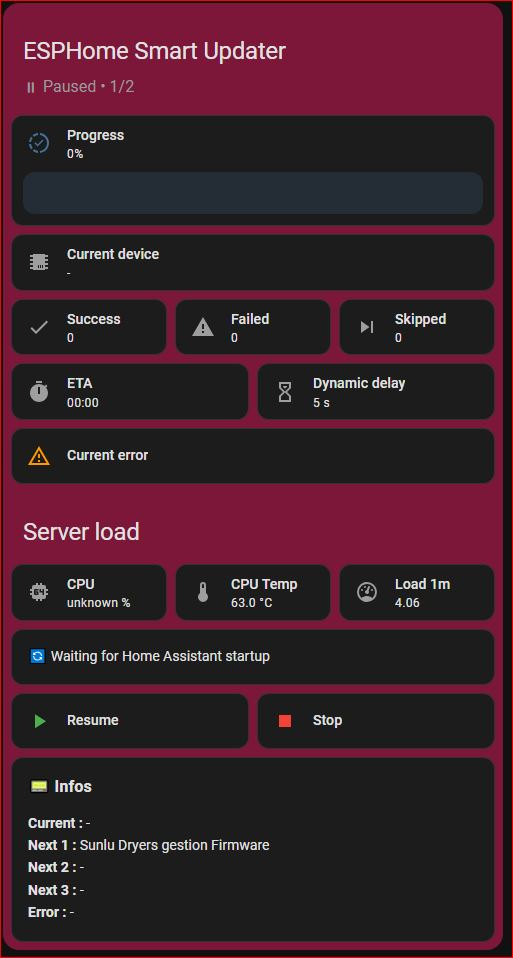

# 🚀 ESPHome Smart Updater

> ⚡ Automate and control your ESPHome OTA updates like a pro


[](https://my.home-assistant.io/redirect/hacs_repository/?owner=PaulBiod&repository=ha-esphome-smart-updater&category=integration)

---

## ✨ Overview

**ESPHome Smart Updater** lets you update all your ESPHome devices in a **controlled, automated, and safe way**.

No more manual updates one by one.
👉 Launch a campaign and let the integration handle everything:

* queue
* throttling
* monitoring
* reporting

---

## 🎥 Preview


---

## 📸 Dashboard



---

## ✨ Features

### 🔄 OTA Campaign Engine

* Queue-based **serial updates**
* Automatic detection of **pending ESPHome updates**
* Full lifecycle tracking:

  * Remaining
  * Done
  * Failed
  * Skipped

### 🧠 Smart Throttling

* Dynamic delay based on:

  * CPU usage
  * CPU temperature
  * System load (1m)
* Prevents overload while maximizing update speed

### 📊 Real-Time Dashboard

* Clean Home Assistant card
* Live tracking:

  * Current device
  * Progress
  * ETA
  * Dynamic delay
* Inline error monitoring

### 📑 Reporting, Notifications & Events

* 📟 Full campaign report (stored + UI)
* 🔔 Persistent notification at campaign end
* 📡 Home Assistant event fired at the end of each campaign:
  `esphome_smart_updater_campaign_finished`

  This event includes:

  * result (success / error / stopped)
  * done / failed / skipped counts
  * duration
  * final report text
  * failed devices details

👉 Perfect for automations, logging, or external integrations

### ⏯ Full Control

* ▶ Start
* ⏸ Pause
* 🔁 Resume
* ⏹ Stop
* 🧹 Clear report

Accessible via:

* UI
* Home Assistant services
* automations

### 🔁 Resilience

* Automatic resume after Home Assistant restart
* Optional delayed resume after startup
* No progress lost

### 🌍 Multi-language

* 🇬🇧 English
* 🇫🇷 Français
* 🇪🇸 Español
* 🇩🇪 Deutsch
* 🇮🇹 Italiano
* 🇵🇹 Português (BR)
* 🇵🇹 Português (PT)
* 🇳🇱 Nederlands
* 🇵🇱 Polski
* 🇨🇿 Čeština
* 🇪🇸 Català

> The interface automatically adapts to your Home Assistant language.

## 🛠 Installation

### 🔘 Option 1 — One-click install

[](https://my.home-assistant.io/redirect/hacs_repository/?owner=PaulBiod&repository=ha-esphome-smart-updater&category=integration)

---

### 🧱 Option 2 — Manual HACS install

1. Open **HACS**
2. Go to **Integrations**
3. Click **⋮ → Custom repositories**
4. Add:

   ```
   https://github.com/PaulBiod/ha-esphome-smart-updater
   ```
5. Category: **Integration**
6. Install **ESPHome Smart Updater**
7. Restart Home Assistant
8. Go to **Settings → Devices & Services**
9. Click **Add Integration**
10. Search for **ESPHome Smart Updater**

---

## ⚙️ Configuration

After adding the integration:

- Configure throttling (optional)
- Select sensors:
  - CPU usage
  - CPU temperature
  - Load 1m

👉 These sensors are available via the [System Monitor integration](https://www.home-assistant.io/integrations/systemmonitor/) 

---

## 🧾 Services

```yaml
esphome_smart_updater.start_campaign
esphome_smart_updater.pause_campaign
esphome_smart_updater.resume_campaign
esphome_smart_updater.stop_campaign
esphome_smart_updater.clear_report
```

---

## 📡 Event (for Automations)

Event fired at the end of a campaign:

```
esphome_smart_updater_campaign_finished
```

### Example automation

```yaml
automation:
  - alias: ESPHome Campaign Finished
    trigger:
      - platform: event
        event_type: esphome_smart_updater_campaign_finished
    action:
      - service: notify.mobile_app_phone
        data:
          message: "ESPHome update finished!"
```

---

## 📊 Lovelace Card

The dashboard card is **not added automatically**.

You must:

* Add it manually
* Paste the provided YAML card

---

## 💡 Example Use Case

👉 You have 20+ ESPHome devices
👉 Multiple updates available

Instead of updating manually:

* launch campaign
* monitor progress
* receive full report

---

## ⚠️ Notes

* Requires Home Assistant restart after install/update
* After restart, you must add the integration from
  **Settings → Devices & Services**
* Designed for local ESPHome OTA management

---

## ❤️ Support

* ⭐ Star the repo
* 🐛 Report issues
* 💡 Suggest improvements

---

## 📜 License

MIT
